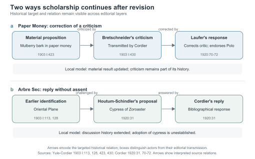
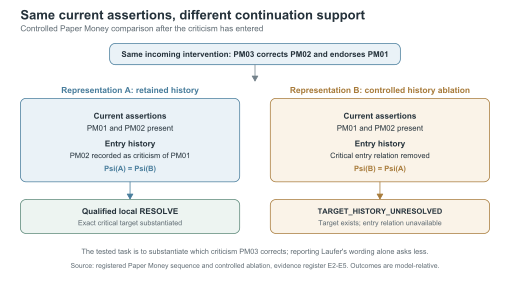

# After Revision: Scholarly Continuation in Digital Editions

## Abstract

Digital editions transmit earlier scholarship to later readers. Their ability to support a later correction or reply depends on whether the earlier act and its target remain recoverable. We develop a Digital Humanities account of **scholarly continuation** through two sequences in the 1903 Yule–Cordier edition of *Marco Polo* and Cordier's 1920 addenda. In Paper Money, Laufer corrects Bretschneider's criticism of mulberry bark in Polo's account; in Arbre Sec, Cordier replies to a competing tree identification without adopting it. Close reading distinguishes the actors, targets, and effects of these interventions. A controlled comparison then holds the represented current assertions constant while removing the recorded entry relation of the criticism. Under the declared Paper Money inquiry, the later correction can be substantiated as a correction *of that criticism* only when the relation remains available. Arbre Sec shows a consequential reply that leaves the represented identification unsettled. Connected records from the Formalization Papers dataset provide a bounded second test of target binding and history-dependent response. The result is an action-relative account of what a digital representation must make available for a later scholarly act to be reconstructed as an intervention upon an earlier one.

**Keywords:** digital scholarly editing; scholarly continuation; editorial history; provenance; digital humanities modelling

## 1. Digital editions condition how scholarship continues

In the 1903 Yule–Cordier edition of *Marco Polo*, a note transmits Emil Bretschneider's criticism of the identification of mulberry bark in Polo's account of paper money. Cordier's 1920 addendum later transmits Berthold Laufer's response: Laufer challenges Bretschneider's criticism and endorses the earlier identification (Yule and Cordier 1903, I:423, 430; Cordier 1920, 70–72). A digital edition could retain the resulting material answer while omitting the criticism that made Laufer's intervention a correction *of Bretschneider*. From that reduced view, a reader could report the answer but would need to return to another source to reconstruct the precise scholarly exchange.

The Arbre Sec entry poses a different risk. Cordier transmits Houtum-Schindler's proposal to identify the tree with the Cypress of Zoroaster and responds to a question about his knowledge and citation of Schindler (Yule and Cordier 1903, I:113, 128; Cordier 1920, 31). That response belongs to the dispute's history. The inspected passage supplies no assent to the proposed identification. Recording every consequential reply as a change of accepted identification would therefore distort this exchange.

These cases motivate **scholarly continuation**: a later act whose scholarly identity depends on how it attaches to an existing record. Later scholarship inherits textual assertions together with earlier interventions that become its possible targets.

Calling an intervention a correction *of a prior criticism* identifies a target, a relation, and a position in an argumentative history. Recording a reply *to a proposal* identifies a different attachment. These distinctions are routine in close reading and scholarly editing. Digital representation makes them technically consequential because a model, schema, interface, or access route may preserve some of them while flattening others.

A revision history can document that changes occurred while leaving a particular relation among them difficult to substantiate. Presence, discoverability, target identity, responsibility, and the conditions for a later intervention are distinct scholarly properties. The relevant question is:

> **How does a digital scholarly representation preserve, constrain, or transform the historically grounded possibilities for scholarship to continue?**

Our evidence and test sequence follow that question. We read two editorial sequences at the level of propositions, actors, and relations in the 1903 and 1920 printed sources. We then compare a retained-history representation with a controlled history-ablated version that has the same current assertions. Finally, we test target binding, current target status, and required entry history in machine-readable review-and-revision records from Formalization Papers (Bucur et al. 2023). The historical readings supply the interpretive basis; the computational comparisons expose what those readings require of a representation.

This question places the article within several established Digital Humanities traditions while identifying a different unit of analysis. Digital scholarly editing treats editions as interpretive constructions. Work on scholarly primitives shifts attention from products to activities such as discovering, comparing, referring, annotating, and assessing (Unsworth 2000). DH modelling makes the selective, interpretive character of computational representations an object of inquiry (McCarty 2003). Versioning and provenance research shows that the history of digital scholarly resources affects citation, interpretation, and future use (Broyles 2020; Vancisin et al. 2023). Broyles explicitly observes that the significance of a change depends on a theory of text, a research use, and an interface. Our question concerns historical dependencies *among* scholarly acts: how an earlier criticism, proposal, or response becomes a possible object of later scholarship.

Our additional claim is that **the history represented by an edition has a structure of possible scholarly continuation**. The same represented state can support one later act but not another. Two later acts can require different parts of the past. And an earlier scholarly act can create the very target or relation that makes a later act intelligible. Digital representation thereby mediates what can be reconstructed *next* from the record under a declared evidentiary horizon.

The claim concerns a declared representation and access horizon: **representational choices condition which later acts can be substantiated as historically grounded continuations of that record.** A scholar may restore a missing relation by reopening an archive, consulting another edition, or extending the representation. Each route adds identifiable interpretive and evidentiary work.

### 1.1 From state and history to continuation structure

To make this claim precise without reducing it immediately to implementation, we distinguish three aspects of a scholarly representation.

**Scholarly state** concerns what the local inquiry currently represents: for example, an identification, reading, attribution, or status.

**Scholarly history** concerns how that represented state arose: the interventions, targets, evidence, responsibility, and relations that connect one scholarly act to another.

**Continuation structure** concerns which specified later scholarly acts can be grounded in that state and history, and which distinctions those acts require.

The third category names a relation between a representation and a family of scholarly continuations. It asks whether a record still supports such acts as correcting a criticism, replying to a proposal, or revising a status *as those acts*, rather than merely allowing some new string or node to be appended.

This triad helps distinguish three claims that are often conflated. A representation may preserve a current assertion without preserving the history needed to reconstruct how a later intervention addresses it. It may preserve an extensive history without exposing the relation a particular continuation requires. And it may preserve an act that changes the history of discussion without changing the current proposition at all.

The two historical sequences examined below instantiate these contrasts. Figure 1 places their actors, targets, and editorial transmission side by side; its arrows summarize the interpretation tested in the article.

### 1.2 The paper's theoretical propositions

The argument proceeds through four propositions.

**T1 — Current-state preservation and continuation support can diverge.**  
Two representations can agree on the current assertions specified for an inquiry while differing in whether a later source-bound intervention can be reconstructed with its historical target and relation.

**T2 — Continuation requirements are action-relative.**  
Different scholarly continuations require different distinctions. A correction of a criticism need not have the same evidentiary requirements as a bibliographical reply or a publication-status revision.

**T3 — Earlier scholarly acts create targets for later acts.**  
An earlier intervention can create a target, relation, or status that a later intervention addresses. A criticism can become the object of a correction; a proposal can become the object of a reply.

**T4 — Scholarly history can change without a change in current scholarly state.**  
An intervention can matter because it alters the record of acknowledgment, responsibility, evidence, or disagreement even when the represented proposition remains unchanged. A digital edition that treats such an event as irrelevant risks erasing the continuation of discussion; one that treats it as a substantive settlement risks manufacturing consensus.

These propositions guide the source reading and the controlled comparisons that follow.

## 2. Two ways scholarship continues

The Yule–Cordier editorial record of *Marco Polo* makes the continuation problem visible because its later editorial layers do not behave as a sequence of simple replacements. They transmit criticism, endorsement, competing identifications, replies, and source judgments with different actors and targets. Two local sequences are especially useful because they show opposite dangers: reducing a historically situated correction to a latest-state replacement, and turning a reply into an assent it does not establish.

### 2.1 Paper Money: correcting a critic

The Paper Money case concerns the material identified in Marco Polo's description of paper currency. In the 1903 third edition, the base discussion associates the material with mulberry bark. A note then transmits Emil Bretschneider's objection: “He seems to be mistaken.” Cordier's 1920 *Notes and Addenda* later introduces Laufer's response with “Laufer writes to me”; Laufer calls the objection “a singular error of Bretschneider” and states that “Marco Polo is perfectly correct” (Yule and Cordier 1903, I:423, 430; Cordier 1920, 70–72). Laufer also accepts Bretschneider's observation that paper was made from *Broussonetia* while rejecting the exclusion of mulberry. The disagreement concerns a specific negative claim, not every part of Bretschneider's botanical account.

The important structure is therefore not merely:

    earlier claim -> later claim

but:

    material claim
        -> criticism of that claim
            -> later correction of the critic
               + endorsement of the material claim

The last intervention addresses two targets in two ways. Laufer criticizes Bretschneider's prior judgment and supports the material identification associated with Polo's account; Cordier transmits both judgments. The distinction prevents the editor's act of transmission from being mistaken for authorship of Laufer's claims.

For the declared material-identification inquiry, the model treats Laufer's response as a local resolution of the represented competition. The criticism remains in the record because it is the target of Laufer's correction. A latest-answer view that removes the criticism would preserve the material identification while losing the exchange through which that answer was defended.

Paper Money therefore motivates T1. The current material identification and the continuation structure of the discussion are not identical objects. A representation can preserve the same current answer yet differ in whether it retains the relation needed to reconstruct the later act as a correction of a prior criticism.

| Documentary position | Interpreted relation | Consequence in the local model |
| --- | --- | --- |
| PM01: material identification | Baseline assertion | Makes the proposition available as a target |
| PM02: Bretschneider's criticism, transmitted by Cordier | Criticizes PM01 | Adds a competing assertion and records its entry relation |
| PM03: Laufer's response, transmitted by Cordier | Corrects PM02 and endorses PM01 | Updates the local material-result state while retaining the critical history |

**Table 1.** Paper Money as a proposition-level sequence. PM03 retains Laufer's correction and endorsement as a compound intervention; the modeled resolution concerns the local represented inquiry state.

### 2.2 Arbre Sec: replying without assenting

The Arbre Sec case makes the opposite point. The earlier edition identifies the object with an Oriental Plane while already preserving an objection-and-response context. The 1920 entry reports Houtum-Schindler's competing identification with the Cypress of Zoroaster. Cordier responds, “I read his paper,” and refers the reader to his citation in the third edition (Yule and Cordier 1903, I:113, 128; Cordier 1920, 31). The response concerns Cordier's prior knowledge and citation of Schindler.

That reply belongs to the history of the identification dispute, but it does not establish that Cordier adopts the cypress identification.

This distinction is easy to lose in a representation that equates meaningful intervention with substantive state change. If Cordier's reply is ignored because it does not replace the current identification, part of the intellectual history disappears. If it is instead encoded as acceptance of Schindler's proposal, the representation invents a settlement not established by the passage.

Arbre Sec therefore motivates T4. A scholarly act can alter the history of discussion without changing the represented proposition. Digital scholarly editing requires a way to preserve such acts as first-class elements of the record.

The case also motivates T2. The Paper Money correction and the Arbre Sec reply do not require exactly the same past. To reconstruct the former as a correction of a prior criticism, the earlier critical relation matters. To record the latter as a bibliographical reply, the immediate requirement is that the specific proposal to which Cordier responds be identifiable as its target; the reply need not thereby inherit or resolve every earlier relation in the identification history.

### 2.3 Sources and interpretive procedure

The close reading uses the 1903 third edition of *The Book of Ser Marco Polo*, volume I (printed pages 113, 128, 423, and 430), and Cordier's 1920 *Notes and Addenda* (printed pages 31 and 70–72). The two sequences were selected from earlier project work because they expose contrasting editorial acts; they are analytical cases, not a sample from which to estimate how often these acts occur. Prior page-image verification and proposition-level source records identify each speaker, the claim addressed, the kind of response, and the editorial layer that transmits it. The passages quoted above have additionally been checked against accessible digitized source text for this revision. Final line-by-line comparison with the fixed page images remains part of submission preparation.

Interpretation precedes computation. The Paper Money record distinguishes Polo's material claim, Bretschneider's criticism, and Laufer's compound correction-and-endorsement as transmitted by Cordier. The Arbre Sec record distinguishes the earlier identification, Houtum-Schindler's alternative, and Cordier's bibliographical reply. These readings determine the event relations supplied to the model; the program does not extract them automatically. Table 1 shows the documentary-to-model mapping for Paper Money, while Figure 1 compares the attachments in both cases. The controlled deletion in Figure 2 removes recorded entry history from a modeled view while leaving the current assertion projection and later intervention fixed. It is a comparison of representations of the same interpreted sequence, not an observed loss in a historical edition.

### 2.4 What the paired cases establish

The cases give the four propositions in Section 1.2 their editorial content. A latest answer and a historically grounded correction can demand different records; a bibliographical reply can matter without changing an identification. Criticisms and proposals also become objects for later acts. The model below asks which of these distinctions remains available to a specified subsequent inquiry.

**Figure 1.** Relations among interventions in two editorial sequences. Arrows run forward through the documentary layers and identify the target of each later act. Cordier transmits Laufer's response in Paper Money and answers Houtum-Schindler's proposal in Arbre Sec; the latter reply records a bibliographical response without an adoption of the cypress identification. Printed source loci are specified in Section 2.3.

The remainder of the article makes these continuation conditions explicit, compares them, and tests them. The next section defines the evidentiary conditions under which a particular later act can be reconstructed from a represented state.

## 3. Testing support for a later scholarly act

### 3.1 The inquiry and its evidence horizon

We use *qualification* for the evidentiary conditions under which a represented record supports a specified later act. For Paper Money, the inquiry asks whether the later passage can be reconstructed as a correction **of Bretschneider's earlier criticism**. Qualification concerns support for that relational description within the declared record; historical truth and wider scholarly acceptance remain questions for source criticism.

This inquiry has a different evidence demand from reporting how Laufer characterizes his own intervention. The latter needs Laufer's passage and its attribution; reconstructing the exchange also needs the earlier criticism and the relation by which it entered. The PM03 event carries an interpreted relation label, while the state supplies independent evidence that PM02 entered as a criticism of PM01. The controlled comparison tests whether that second component remains available. A missing component is reported as an unresolved condition rather than silently converted into a generic update.

Qualification is evaluated against a declared evidence horizon: the available source passages, their interpreted relations, the represented state, and any permitted recovery procedure. Consulting another edition or reconstructing an omitted relation from the full passage may restore support for the act. The experiment fixes that horizon so that its two representations can be compared.

### 3.2 Current assertions and retained history

Let S denote the represented scholarly state. Its current-assertion projection, Ψ(S), records the assertions and statuses treated as current in the local inquiry. Its evidence and history projection, Ξ(S), retains the relevant documentary events, relations, responsibility, and transitions. These projections operationalize the state/history distinction introduced in Section 1.1.

An incoming intervention e supplies its source-bound relation kind, target, and evidence or proposal. For an action type g, Q_g(S,e) records whether the specified act is qualified. The model also records why a test fails: the target may be absent, the current version may be invalid, or the required target history may be unresolved. If an act qualifies, execution produces a revised state and a record of change. Thus the article's **continuation structure** is the pattern of which specified later acts a representation supports, why, and how each supported act changes the record; Q_g is its testable qualification component.

The Paper Money comparison can now be stated compactly:

\[
\Psi(S_{\mathrm{full}})=\Psi(S_{\mathrm{ablated}}),
\qquad
Q_{\mathrm{RESOLVE}}(S_{\mathrm{full}},e_{\mathrm{PM03}})
\ne
Q_{\mathrm{RESOLVE}}(S_{\mathrm{ablated}},e_{\mathrm{PM03}}).
\]

**Figure 2.** Controlled Paper Money comparison. Both representations retain the same current assertions and receive the same later intervention. The full view retains the record that PM02 entered as a criticism of PM01; the reduced view removes that record. Only the full view supports reconstruction of PM03 as a correction *of PM02* under the declared evidence horizon. The reduced view is constructed for this test.

The equality concerns the declared current projection. The full documentary record, including other admissible ways to recover the missing relation, remains a separate object of inquiry. Under the fixed horizon of this comparison, the reduced representation lacks a distinction needed for the specified reconstruction.

### 3.3 Binding requirements differ from state requirements

The exact target of an intervention and the current status of that target are related but distinct. The event can name the correct proposition even when that proposition is absent from the state being consulted. Conversely, an appropriate-looking assertion can be present while the event is bound to a different proposition. Treating both cases as a single target field would conceal the difference between misbinding an intervention and misrepresenting the status of its correctly named target.

We therefore represent the requirements of an action by a typed signature:

\[
\Sigma(g)=(\Beta(g),\Kappa(g)).
\]

Β(g) identifies the event-side binding conditions: the exact object, source or version, relation kind, and target identity. Κ(g) identifies the state-side conditions: whether the bound target is available for the action, whether an update is current, what competing assertions are represented, and whether required target-entry history is retained. *Live* is the model's term for a target available under these state conditions; it does not designate consensus in the wider scholarly community.

This typing also disciplines the experiments. A wrong-target test changes the event binding while holding the state fixed. A missing-history test keeps the event fixed while changing the state. A requirement should not be counted twice merely because one perturbation simultaneously affects target identity and target lookup. Where the available cases do not separate these dimensions, the confounding must remain visible.

For a fixed admissible event binding, define action-relative state equivalence by agreement on the state distinctions inspected for that action:

\[
S\sim_g S'
\quad\Longleftrightarrow\quad
P_{\Kappa(g)}(S)=P_{\Kappa(g)}(S').
\]

The projection here is evaluated with the same bound event in both states. If the specified qualification rule factors through that projection, then

\[
S\sim_g S'\ \Longrightarrow\ Q_g(S,e)=Q_g(S',e).
\]

This implication follows from the stated rule: states that agree on every condition inspected by that rule must yield the same qualification result. The general question of whether a view determines an answer has a substantial technical literature (Nash, Segoufin, and Vianu 2010). Here the substantive work is to establish the historically meaningful conditions for particular editorial acts and to test how those conditions behave when acts are composed. The finite checks assess implementation and contrastive behavior; they do not turn the implication into a new general theorem.

### 3.4 What the evaluation tests

The evaluation combines the close readings described in Section 2.3, two separately implemented qualification-and-execution paths, and controlled transformations of the represented state. The source-derived relation labels were fixed before the relevant composition tests. Both historical sequences run through the same target-bound implementation without episode-name or claim-identifier branches. Agreement between implementations checks conformity to the specified rules; determining whether a passage is a correction or bibliographical reply remains an interpretive act documented in the source reading.

The controls have different purposes. Removing a required relation tests whether the specified act loses support. Perturbing a condition the rule does not inspect tests whether the implementation is unnecessarily restrictive. Supplying a later intervention before its target has entered tests sequence dependence. These are finite model tests over documentary inputs.

## 4. Not every continuation requires the same past

### 4.1 Arbre Sec: recording a reply without manufacturing assent

The Arbre Sec reading in Section 2.2 supplies the contrast. Its 1903 layer already contains an identification and a botanical objection-and-response context. The modeled starting state therefore contains an identification with prior interpretation. The 1920 layer introduces Houtum-Schindler's cypress proposal and Cordier's bibliographical reply. Recording that reply as assent would turn evidence of prior reading and citation into an identification Cordier did not explicitly adopt in the inspected passage.

The distinction is consequential. Were Cordier's reply treated as a resolution of the identification, the representation would turn evidence of prior reading into evidence of assent. Were the reply omitted because it leaves the competing identifications unchanged, the representation would erase an act that bears on the history and responsibility of the discussion. The model therefore records it as an evidence-bearing reply directed at the proposal, while retaining both competing identification assertions.

In the model, adding the alternative makes the cypress proposal available as a distinct target; recording Cordier's reply then attaches evidence to that target. The implemented action types are `ADD_ALTERNATIVE` and `RECORD_EVIDENCE`. Their execution preserves the current assertion projection while changing the retained evidence and history:

\[
\Psi(S_{\mathrm{before\ reply}})=\Psi(S_{\mathrm{after\ reply}}),
\qquad
\Xi(S_{\mathrm{before\ reply}})\ne\Xi(S_{\mathrm{after\ reply}}).
\]

For this specified reply, the model inspects the target's identity and availability, without requiring its earlier entry transition. Paper Money's correction has the additional demand of identifying the target's entry as a criticism. The two later acts therefore read different parts of their represented histories.

### 4.2 Comparing obligations rather than quantities of metadata

The paired cases show that the evidence needed for a later act depends on the act's relation to its target. Table 2 compares these requirements with two actions from the machine-readable record examined in Section 6. Its rows report the focal conditions; the full specifications also check source, relation, proposal, and status.

| Specified later act | Focal binding and current-state conditions | Is retained target-entry history inspected for qualification? |
| --- | --- | --- |
| Paper Money: correct the prior criticism, modeled as RESOLVE | The correction addresses the live critical assertion; the proposal matches the relevant live alternative | Yes: the target's entry as a criticism of the prior assertion must be established |
| Arbre Sec: record Cordier's bibliographical reply | The reply addresses the particular available competing proposal | No, for this specified reply |
| Formalization Papers: record a response | Exact review/update targets are available and current | Yes: the relevant review/update entry history must be established |
| Formalization Papers: revise publication status | Exact target binding and the required current update | No, for this specified status action |

**Table 2.** Contrasting requirements for four specified actions. “No” means that the named action does not inspect target-entry history during qualification; another inquiry may still need it.

The finite signature audit checks 120 action contexts: four from the two Yule–Cordier sequences and 116 from Formalization Papers (48 review, eight replacement, 52 response, and eight publication-status contexts). All 120 retained their qualification result under transformations that preserve the conditions inspected by the action. All 393 required-condition tests changed or blocked the specified action as expected; all 19 tests altering a nonrequired history condition preserved qualification. The 393 include target binding and state requirements as well as history requirements.

These are tests of a specified finite model, not independent historical episodes or estimates of prevalence. Their value is discriminatory: changing a required condition affects the action, while changing a tested nonrequired history condition does not. The comparison asks what a particular continuation reads, rather than rewarding a representation simply for carrying more metadata.

## 5. Earlier acts establish later possibilities

The two historical sequences show why later acts cannot be assessed from an unordered inventory of statements. In Paper Money, recording the criticism creates a competing target and establishes its relation to the baseline. A correction attempted before that target enters is rejected because the target is absent. If the target remains but its critical entry relation is removed, the same later intervention receives a different diagnosis: the target exists, but the history needed to substantiate the correction is unresolved.

Arbre Sec separates target creation from history-dependent continuation. Recording the competing identification creates the target to which Cordier's reply is bound. Before that proposal is present, the reply does not qualify. After it is present, the reply can be recorded without reading its entry history. The earlier act therefore enables a later act even where the later act neither changes the current identification assertions nor requires the full transition record.

An earlier act can create the target named by a later event, make it available in the represented state, establish its version status, or supply the entry relation inspected by a later qualification rule. The sequence audit checks these concrete dependencies. Both historical sequences satisfy the specified forward and premature-action controls.

The premature-action controls ask whether an intervention is available from a specified starting state. They reveal order-sensitive dependencies within the tested sequences. “Sequence closure” means that the earlier acts in a tested chain supply the conditions inspected by its later acts.

The resulting humanistic claim concerns the afterlife of an intervention. A criticism can become an object of later criticism; a proposal can become the object of a reply. Earlier scholarly work thus produces some of the objects and relations through which later inquiry proceeds. Preserving only a conclusion can remove the means of distinguishing these continuations. Preserving a reply only as a conclusion change can do the opposite: invent a settlement where the record contains a further act of discussion.

## 6. A bounded test in an independent scholarly ecology

The Yule–Cordier cases establish the article's interpretive problem. Formalization Papers, a scholarly publishing record associated with Bucur and colleagues (2023), provides a second documentary setting in which later acts explicitly target earlier ones. Its machine-readable links among submissions, reviews, updates, responses, and decisions permit the same distinctions—exact target, available target, and retained entry history—to be tested without supplying relations by close-reading these two editorial passages. This is a mechanism comparison across two kinds of scholarly record, with the printed edition remaining the historical core of the DH argument.

The source snapshot contains ten record files. Reconstructing the relation graph yields fifteen candidate roots: eight have the complete structure required by the declared composition test, and seven are ambiguous or lack functional relations for that test. All fifteen receive a documented disposition. The eight eligible roots yield 52 connected review–update–response–decision chains under the fixed enumeration rule. Chains share roots and documentary components, so 52 is the number of testable paths, not 52 independent scholarly episodes.

In the corrected execution, all 52 eligible chains satisfy the specified forward and counterfactual checks. A chain records a review, replaces the represented formalization, records a response, and revises publication status. Controls attempt later acts before their targets exist, substitute wrong targets where structurally possible, and remove required history while holding the current update projection fixed. A separate auditor reconstructs the roots and connected chains from the source files and obtains the same population as the main analysis.

A further diagnostic comparison uses three information views: one with functional relation-target bindings, one that also checks whether a target is currently available, and one that additionally retains the history required for the response action. Table 3 reports the results on three different test populations. “False availability” means that a view admits an action despite the source-derived conditions specified for this test.

| Test population | Functional target binding | Binding plus live/current target | Binding, current target, and required history |
| --- | ---: | ---: | ---: |
| Valid response contexts retained, n = 52 | 52/52 | 52/52 | 52/52 |
| False availability on natural non-live-target response acts, n = 47 | 47/47 | 0/47 | 0/47 |
| False availability on controlled history-ablated response contexts, n = 52 | 52/52 | 52/52 | 0/52 |
| Availability on the nonfunctional-target control, n = 1 | 0/1 | 0/1 | 0/1 |

**Table 3.** Information-view comparison for response qualification. The 47 naturally non-live-target acts and 52 constructed history-ablated contexts have different denominators. The columns are defined information projections, not implementations of a named metadata standard.

The comparison distinguishes two obligations. A relation can point to a target that is unavailable for the specified action; checking target availability removes the 47 false admissions in that population. An available target can still lack the recorded entry history required for a response; checking that history removes the 52 false admissions in the constructed ablation population. All 52 valid response contexts remain available in every view. The publication-status contrast in Table 2 shows why entry history is required for some acts but not all.

The first prospective execution failed a parser check and yielded no valid confirmatory result. The corrected reproduction used the identical source archive after repairs to date-time serialization and multi-valued creator handling; independent parsers then agreed on the relevant source surface. The 52-chain result is reported as a **corrected reproduction**, while the subsequent signature and information-view comparisons are post-exposure diagnostic analyses. The initial failed execution remains part of the public evidence record.

## 7. Implications for digital editions and historical records

### 7.1 A theory of the continuation structure of editions

The paired readings revise the unit in which an edition's scholarly value is described. An edition has a current scholarly state and a history of interventions, yet its capacity to support further inquiry depends on how earlier acts remain available as the objects of later ones. This **continuation structure** is therefore a relation among acts across editorial layers. In Paper Money, Bretschneider's criticism creates a specific target for Laufer's correction. In Arbre Sec, Houtum-Schindler's proposal creates a target for Cordier's bibliographical reply. The second response changes what the record says about the discussion while leaving the identification unsettled. The editorial question is which of these relations a later researcher can substantiate from the representation at hand.

This claim extends established DH accounts of scholarly activities and modelling. Unsworth (2000) directs attention to recurring activities such as annotation, comparison, and reference. McCarty (2003) treats modelling as selective, experimental inquiry into its object. We ask what happens when *one scholarly activity becomes a condition for identifying another*: when a correction is a correction **of** an earlier criticism, or a reply is a reply **to** a proposal. These prepositions bind responsibility, target, and relation within an interpretable history.

The neighbouring edition and provenance literature already recognizes the dependence of change significance on scholarly purpose. Broyles (2020, note 43) explicitly connects what counts as a breaking change to theories of the edited text, research uses, and interfaces. Vancisin and colleagues (2023) connect transformations of historical records to later questions and interpretation. Bleeker and colleagues (2022) show how revision layers demand an interpretive computational model. Our distinct step is to compare the *qualification of particular next acts* under representations with controlled differences in the histories they expose. The historical reading remains the interpretive premise. Computation makes its representational consequences inspectable, including the difference between a reply and assent or between a correction of a criticism and a latest-state update.

The two figures make different aspects of the argument visible. Figure 1 shows which earlier intervention each later act addresses. Figure 2 holds current assertions constant and isolates the effect of retaining or removing the critical entry relation. Together they distinguish an edition's chronological sequence from its support for a specified next scholarly act. A working view can recover support by reconnecting to an admissible source passage that supplies the missing relation.

### 7.2 Carrier-neutral obligations

No particular serialization is intrinsically the answer. The PROV data model offers entities, activities, agents, and relations through which histories can be represented (W3C 2013). TEI's revisionDesc records a file's revision history (TEI Consortium n.d.). These facilities can contribute to an implementation, but the history of changes to a modern encoded file must be distinguished from the historical scholarly acts represented within it. A file edit performed by a contemporary encoder is not automatically the same event as a criticism transmitted by Cordier.

Graph relations, textual apparatus, and recoverable versioned records can each carry the distinctions identified here. In an earlier recovery audit, native Gutenberg text retained recoverable carriers for the five historical distinctions tested when the relevant passages were supplied. The obligation is therefore to preserve or recover the relation needed by the inquiry, rather than to prescribe one file format or assume that plain text erases it.

What must survive is the needed distinction under the declared means of access, not necessarily a field with the same name as in our implementation. If another admissible carrier reconstructs the exact target relation, that is a legitimate solution. Conversely, merely retaining a large volume of historical material does not demonstrate that a specific operation can recover the relation it needs. Storage, exposure, interpretation, and qualification should not be treated as synonyms.

### 7.3 Minimality without premature deletion

An action-relative requirement is useful because it names a specific scholarly task. The Arbre Sec reply rule does not read the proposal's entry history, while an inquiry into priority, mediation, or the development of the identification may require it. Likewise, the publication-status action and a historical account of the preceding response require different evidence. The tested reduced views are working views linked to retained sources, not preservation policies for deleting archival evidence.

When future questions are unknown, the relationship between a reduced working view and the retained source record becomes especially important. The model identifies the evidence demanded by its declared family of acts; later researchers can reopen the sources for questions beyond that family.

Finally, the treatment of Arbre Sec shows why a current-state interface should leave room for consequential acts that do not settle a proposition. A bibliographical reply can change what the edition records about acknowledgment and participation without resolving the identification. Keeping that distinction available is not merely a technical refinement. It prevents the digital account from manufacturing consensus and permits the history of a discussion to remain visible as a history of discussion.

## 8. Limits and conclusion

### 8.1 Evidentiary limits

The two historical sequences were selected because they distinguish a correction from a bibliographical reply. They support a bounded interpretive contrast, not an estimate of how often such acts occur in the Yule–Cordier corpus. Paper Money's last event combines a correction and endorsement in one modeled intervention; Arbre Sec offers a cleaner single-act reply. Earlier arguments quoted by Cordier are examined through their editorial transmission here, rather than as independently inspected witnesses.

Independent historical corroboration remains unresolved. A blinded three-model audit completed 45 calls over five cases; only nine responses met the predeclared source-citation criterion, and none of the 21 atomic components reached the required stable two-model agreement. This partial result is reported as a limitation on corroboration of the source readings. It is distinct from the computational tests of the specified representations.

The computational tests evaluate the consequences of the stated interpretations and rules. Independent implementations reduce implementation risk, while the historical requirement built into each rule remains open to scholarly challenge. The Paper Money comparison establishes what follows when reconstructing a correction *of an earlier criticism* requires evidence of that criticism's entry relation. An alternative inquiry that reports only Laufer's later characterization has a different evidence demand.

The finite tests also leave three Yule witnesses in which exact target identity and live-target lookup change together. Formalization Papers supplies additional typed probes, although its chains share roots and its first prospective execution failed. The reported counts describe tested contexts and paths; they provide no estimate of cross-domain prevalence or automatic extraction accuracy.

The current-state equality in Figure 2 is an experimental condition on a declared projection. Enriching that projection or permitting recovery from another source can restore the missing relation. This specifies the access boundary of the result and points to practical ways a digital edition can support the inquiry.

### 8.2 Conclusion

The editorial record must be able to preserve more than the answer that happens to be current. It must sometimes preserve the relations through which that answer became a correction, an alternative, or a response. Yet the required past is not the same for every continuation. The Paper Money correction needs the represented history of a prior criticism; the Arbre Sec reply needs its identifiable proposal without thereby adopting it. Their contrast makes preservation obligations action-relative rather than a uniform demand for more metadata.

Earlier scholarly acts establish some of the targets and conditions on which later acts depend. The bounded computational account makes those dependencies explicit and tests where they survive controlled transformations. A digital edition can use this account to disclose which continuations its representation supports, which remain unresolved, and which relations a researcher would need to recover from the source record.

## References

Birnbaum, David J., and Elena Spadini. 2020. “Reassessing the Locus of Normalization in Machine-Assisted Collation.” *Digital Humanities Quarterly* 14 (3). https://www.digitalhumanities.org/dhq/vol/14/3/000489/000489.html.

Bleeker, Elli, Bram Buitendijk, Ronald Haentjens Dekker, Vincent Neyt, and Dirk Van Hulle. 2022. “Layers of Variation: A Computational Approach to Collating Texts with Revisions.” *Digital Humanities Quarterly* 16 (1). https://dhq.digitalhumanities.org/vol/16/1/000583/000583.html.

Broyles, Paul A. 2020. “Digital Editions and Version Numbering.” *Digital Humanities Quarterly* 14 (2). https://www.digitalhumanities.org/dhq/vol/14/2/000455/000455.html.

Bucur, Cristina-Iulia, Tobias Kuhn, Davide Ceolin, and Jacco van Ossenbruggen. 2023. “Nanopublication-Based Semantic Publishing and Reviewing: A Field Study with Formalization Papers.” *PeerJ Computer Science* 9: e1159. https://doi.org/10.7717/peerj-cs.1159.

Cordier, Henri. 1920. *Ser Marco Polo: Notes and Addenda to Sir Henry Yule's Edition, Containing the Results of Recent Research and Discovery*. London: John Murray. [Digitized copy](https://resources.warburg.sas.ac.uk/pdf/ndb90b2753728.pdf).

McCarty, Willard. 2003. “‘Knowing True Things by What Their Mockeries Be’: Modelling in the Humanities.” *Computing in the Humanities Working Papers* A.24. https://chwp.artsci.utoronto.ca/CHC2003/McCarty2.htm.

Nash, Alan, Luc Segoufin, and Victor Vianu. 2010. “Views and Queries: Determinacy and Rewriting.” *ACM Transactions on Database Systems* 35 (3), article 21: 1–41. https://doi.org/10.1145/1806907.1806913.

TEI Consortium. n.d. “revisionDesc (Revision Description).” *TEI P5: Guidelines for Electronic Text Encoding and Interchange*. https://tei-c.org/release/doc/tei-p5-doc/en/html/ref-revisionDesc.html. Accessed 30 September 2026.

Unsworth, John. 2000. “Scholarly Primitives: What Methods Do Humanities Researchers Have in Common, and How Might Our Tools Reflect This?” King’s College London, 13 May. https://people.brandeis.edu/~unsworth/Kings.5-00/primitives.html.

Vancisin, Tomas, Loraine Clarke, Mary Orr, and Uta Hinrichs. 2023. “Provenance Visualization: Tracing People, Processes, and Practices through a Data-Driven Approach to Provenance.” *Digital Scholarship in the Humanities* 38 (3): 1322–1339. https://doi.org/10.1093/llc/fqad020.

W3C. 2013. *PROV-DM: The PROV Data Model*. W3C Recommendation, 30 April 2013. https://www.w3.org/TR/prov-dm/.

Williamson, Elizabeth R. 2026. “Digitized Archives, Content Providers, and Slow Scholarship: Why Archival Researchers Should Care about Digital Provenance.” *Digital Scholarship in the Humanities* 41 (3): 1705–1723. https://doi.org/10.1093/llc/fqag062.

Yule, Henry, and Henri Cordier. 1903. *The Book of Ser Marco Polo*. Third edition. Vol. I. London: John Murray. [Digitized volume](https://wellcomecollection.org/works/j5n87wpb).

## Evidence and materials statement

The printed source passages and their page-image anchors, interpretive claim records, protocols, scripts, raw outputs, correction history, and denominator audits are documented in the [source and evidence register](SOURCE_NOTES_AND_SUBMISSION_GAPS.md) in the [project repository](https://github.com/MKLEE222/claim-relative-representation). The Formalization Papers analysis used a fixed ten-file snapshot of the [supplementary repository](https://github.com/LaraHack/formalization_papers_supplemental); its exact commit and archive checksum appear in the register. That register also separates the failed prospective execution, corrected reproduction, and subsequent diagnostic analyses. Final source-image quotation checks and the dataset's reuse terms remain submission requirements.

